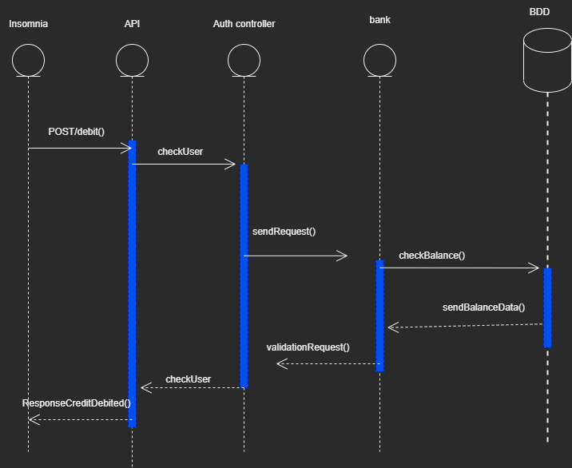
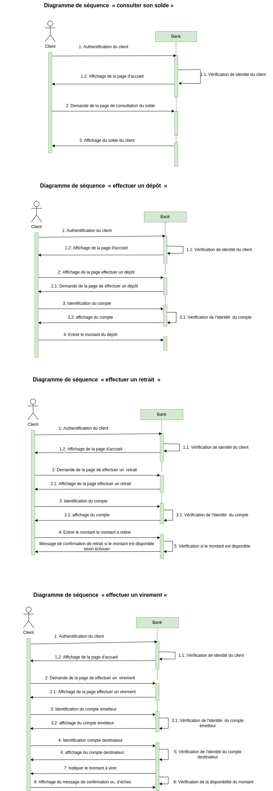
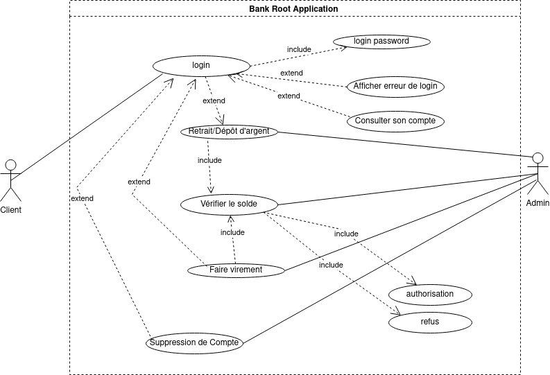

# Conception et  Sécurisation de l'application Bank Root 🏦

## Stratégie de conception :

Création du compte :
- L'utilisateur pourras créer un compte, pour cela on auras besoin du nom prénom et adresse de l'utilisateur, on lui demanderas de créer un mot de passe, une fois les données entrée dans le formulaire d'inscription, les données vont être enregistrer dans la base de donnée, le mot de passe sera cryptée, un numéros unique sera générer et il y aura un lien avec un token d'une durée limiter pour que l'utilisateur confirme son inscription. Une fois cela fait, nous lui demanderons une connection à son compte qui vient d'être créer. Nous allons imaginer un soldes fictifs sur son comptes.

Connexion :
- Lors de la connexion, nous mettrons en place un tokken, et nous mettrons une durée de session à durer limitée pour notre utilisateur.

Débiter :
- Il sera possible de débiter l'argent pour un débit, pour cela nous allons imaginer un débiteurs, avec le montant définis, et une date et heure définis pour un débit qui se feras plusieurs fois. J'imagine donc qu'il faudras simuler et créer deux compte différent, et faire les fonction adapter à cela.

Créditeurs :
- De la même manières que le débiteurs, ce sera le deuxième compte qui utiliseras la fonction adapter à cela sur notre utilisateur, avec les infos adapter tel que la dates, l'heure le jour et le nom du créditeurs. Je pense que pour ces deux la nous aurons besoin d'une base de données relationnelle qui lieras nos débiteur et créditeurs.

Transactions :
- Une base de données relationnelles pour les transactions entre différent comptes, celui qui envoie et celui qui reçois, une fonction qui envoie le montant pour celui qui paye et une autres qui récupères le montant envoyer.

## La strategie de la sécurité : 🔐

#### Sauvegarde:🛟

##### * La réduction de la surface d’attaque
###### Par le fait qu'un client ou un utilisateur ne pourra acceder  que à ses données

##### * la journalisation: 
###### La mise en place d'un fichier journalisation ,  pour enregistrement dans des  des activités des utilisateurs, des anomalies et des événements liés à la sécurité

##### * RPGD(Le règlement général sur la protection des données):
###### Expliquer aux utilisateurs  la raison de cette collecte de données,

##### * Une stratégie de sauvegarde(3-2-1(3-2-1 ) :
###### Pour s'assurer que les données sont stockées ailleurs en cas de vol ou de destruction de données

##### * Cookies:
###### L'utilisation de cookies pour améliorer l'expérience utilisateur

#### La Politique de sécurité des mots de passe:🗝

##### *\  Longueur des mots de passe:
###### On a Défini une longueur minimale permet d’avoir un certain contrôle sur le niveau de sécurité apporté par les mots de passe lors de leur création par les utilisateurs

##### * Mise en œuvre des règles sur la complexité des mots de passe

##### * Le stockage du mot de passe après le hachage

#### La stratégie de sécurisation d’API et les utilisateurs:🚫

##### * Utilisation le protocole Https au lieu du protocole Http pour assurer la sécurité des données envoyées entre les clients et le serveur
##### * L'accès aux données se fait par l'authentification et l'autorisation : Chaque utilisateur doit s'authentifier pour accéder à son compte et chaque utilisateur a le droit d'accéder à certaines ressources
##### * Les entrées fournies par les utilisateurs doivent être sanitisé(SANITIZATION), pour éviter les attaques SQLi
##### * CSP (Content Security Policy). Contre le détournement de clic(clickjacking), CSRF(Cross-Site Request Forgery) et XSS (Cross-Site Scripting)

## Conception : UML

### Diagramme de classe

### Diagramme de séquence 

#### Creditation
.png)

#### Debitation

#### SOLDE/DEPOT/RETRAIT/VIREMENT

 
### Diagramme de cas d'utilisation

