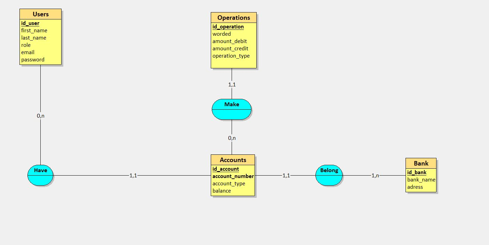
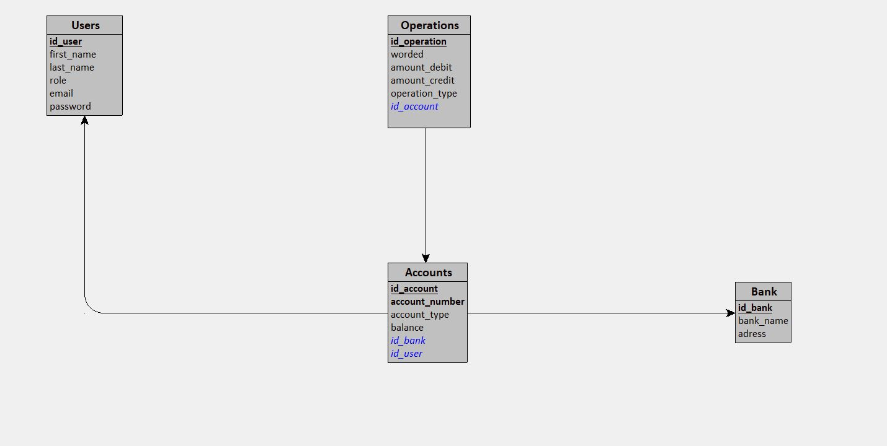

# Conception et Sécurisation de l'application Bank Root 🏦

## La conception : MERISE
 #### Le MLD 
 

 #### Le MLD
 

 #### Le dictionnaire de données :

firstName
lastName
numberAccount
debiteur
crediteur
soldes
transaction
montant
userTypes
libéléOpération
password
email
emailBank
nameBank
other_Bank_Id
id_bank
Entités :

User :
- id_user
- firstName
- lastName
- id_user
- user_types
- email
- password

Bank_Account :
- id_account
- account_number
- sold
- account_type

Operation :
- id_operation
- libeler
- amount
- type_operation

Bank :
- id_bank
- bank_name
- adress

## La strategie de la sécurité: 🔐

#### Sauvegarde:🛟

##### * La réduction de la surface d’attaque
###### Par le fait qu'un client ou un utilisateur ne pourra acceder  que à ses données

##### * la journalisation: 
###### La mise en place d'un fichier journalisation ,  pour enregistrement dans des  des activités des utilisateurs, des anomalies et des événements liés à la sécurité

##### * RPGD(Le règlement général sur la protection des données):
###### Expliquer aux utilisateurs  la raison de cette collecte de données,

##### * Une stratégie de sauvegarde(3-2-1(3-2-1 ) :
###### Pour s'assurer que les données sont stockées ailleurs en cas de vol ou de destruction de données

##### * Cookies:
###### L'utilisation de cookies pour améliorer l'expérience utilisateur

#### La Politique de sécurité des mots de passe:🗝

##### *\  Longueur des mots de passe:
###### On a Défini une longueur minimale permet d’avoir un certain contrôle sur le niveau de sécurité apporté par les mots de passe lors de leur création par les utilisateurs

##### * Mise en œuvre des règles sur la complexité des mots de passe

##### * Le stockage du mot de passe après le hachage

#### La stratégie de sécurisation d’API et les utilisateurs:🚫

##### * Utilisation le protocole Https au lieu du protocole Http pour assurer la sécurité des données envoyées entre les clients et le serveur
##### * L'accès aux données se fait par l'authentification et l'autorisation : Chaque utilisateur doit s'authentifier pour accéder à son compte et chaque utilisateur a le droit d'accéder à certaines ressources
##### * Les entrées fournies par les utilisateurs doivent être sanitisé(SANITIZATION), pour éviter les attaques SQLi
##### * CSP (Content Security Policy). Contre le détournement de clic(clickjacking), CSRF(Cross-Site Request Forgery) et XSS (Cross-Site Scripting)

 